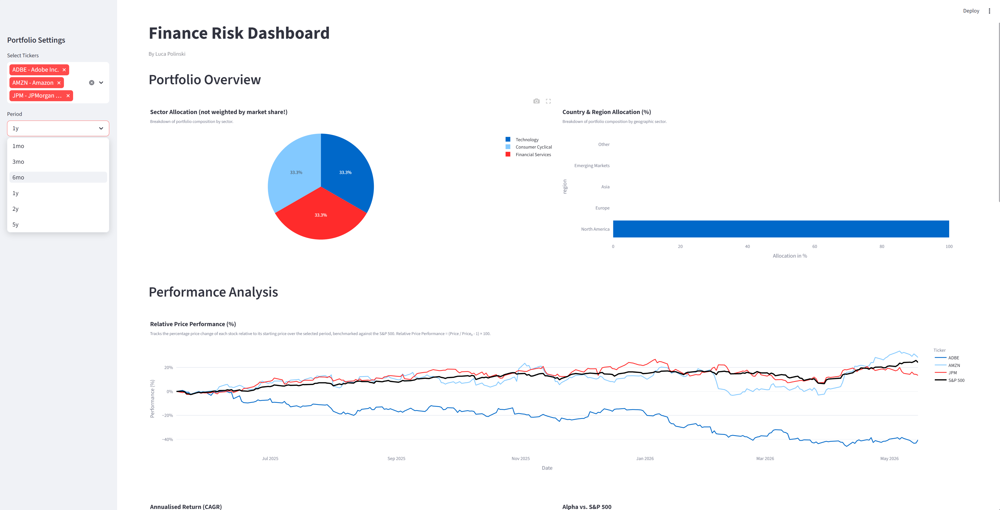
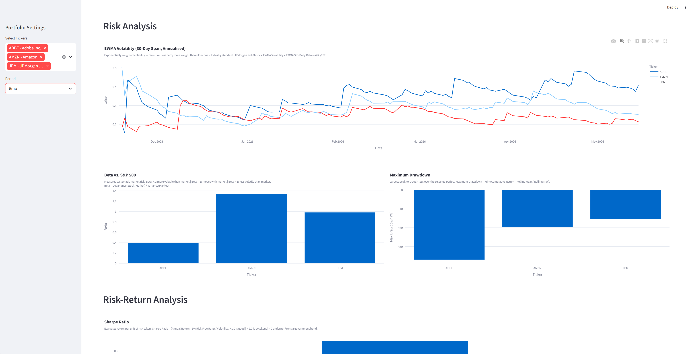

# Finance Risk Dashboard

A Python-based risk analytics dashboard for analyzing stock portfolios.
Built as a portfolio project targeting FinTech Risk Analytics roles.





---

## Overview

Interactive dashboard that fetches live market data for any S&P 500 stock and computes a full suite of risk and performance metrics. Users select tickers and a time period via the sidebar — all charts update in real time.

---

## Project Structure

```
finance-risk-dashboard/
├── src/
│   ├── __init__.py
│   ├── portfolio.py      ← core analytics class
│   └── universe.py       ← S&P 500 universe & region mapping
├── notebooks/
│   ├── 01_data_loading.ipynb
│   ├── 02_risk_metrics.ipynb
│   └── 03_visualization.ipynb
├── app.py                ← Streamlit dashboard
├── requirements.txt
├── .gitignore
└── README.md
```

---

## KPIs

### Portfolio Overview
| Metric | Description |
|--------|-------------|
| Sector Allocation | Portfolio composition by GICS sector |
| Geographic Allocation | Portfolio composition by region (North America, Europe, Asia, Emerging Markets) |

### Performance Analysis
| Metric | Formula |
|--------|---------|
| Relative Price Performance | (Price / Price₀ - 1) × 100 — benchmarked against S&P 500 |
| Annualised Returns |  | (1 + Total Return)^(252/n) - 1 |
| Jensen's Alpha | (Stock Return - RF) = α + β × (S&P 500 Return - RF), α annualised × 252 |

### Risk Analysis
| Metric | Formula |
|--------|---------|
| EWMA Volatility (30-Day Span, Annualised) | EWMA Std(Daily Returns) × √252 |
| Beta | Covariance(Stock, Market) / Variance(Market) |
| Maximum Drawdown | Min((Cumulative Return - Rolling Max) / Rolling Max) |

### Risk-Return Analysis
| Metric | Formula |
|--------|---------|
| Sharpe Ratio | (Annual Return - 5% Risk-Free Rate) / Volatility |

---

## Tech Stack

| Library | Purpose |
|---------|---------|
| yfinance | Live market data via Yahoo Finance API |
| pandas | Data processing |
| numpy | Mathematical calculations & CAPM regression |
| plotly | Interactive charts |
| streamlit | Web dashboard |

---

## Design Decisions

- **Benchmark:** S&P 500 (^GSPC) — standard benchmark for US equities
- **Risk-Free Rate:** 5% US Treasury — used for Jensen's Alpha and Sharpe Ratio
- **Trading Days:** 252 — standard annualisation factor
- **CAPM Regression:** Single `np.polyfit` call extracts both Alpha and Beta simultaneously
- **Eager Loading:** All data fetched at Portfolio init — one loading phase, instant KPI methods thereafter

---

## Limitations

### Technical
- **Metadata loading** — one API call per ticker via `yfinance.Ticker().info`. Slow for large portfolios (10+ tickers). Production solution: batch API or dedicated data provider.
- **yfinance reliability** — Yahoo Finance occasionally returns incomplete or incorrect metadata (sector, country). Data quality degrades for non-US listings.
- **Region mapping** — `REGION_MAP` covers 14 countries. S&P 500 companies headquartered in Ireland, Israel, Australia and others default to "Other".
- **Caching** — `st.cache_data` is optimised for serialisable objects like DataFrames. Caching the full `Portfolio` object is a pragmatic simplification. Production solution: cache raw price data and instantiate Portfolio separately.
- **No authentication** — dashboard is stateless and has no user authentication. Not suitable for multi-user production deployment without additional infrastructure.

### Financial
- **No VaR** — Value at Risk (95%) is a Basel III standard risk metric and is not yet implemented.
- **No weighted returns** — portfolio-level returns assume equal weighting across all tickers. Market-cap or custom weighting is not supported.
- **Rolling volatility** — standard 30-day rolling window is used. EWMA (Exponentially Weighted Moving Average) would react faster to market regime changes and is the industry standard (JPMorgan RiskMetrics).
- **Static risk-free rate** — 5% US Treasury rate is hardcoded. In practice this rate changes over time and should be fetched dynamically.
- **US equities only** — universe is limited to S&P 500 constituents. No support for fixed income, commodities, or international equities.

---

## Installation

```bash
pip install -r requirements.txt
```

## Usage

```bash
streamlit run app.py
```